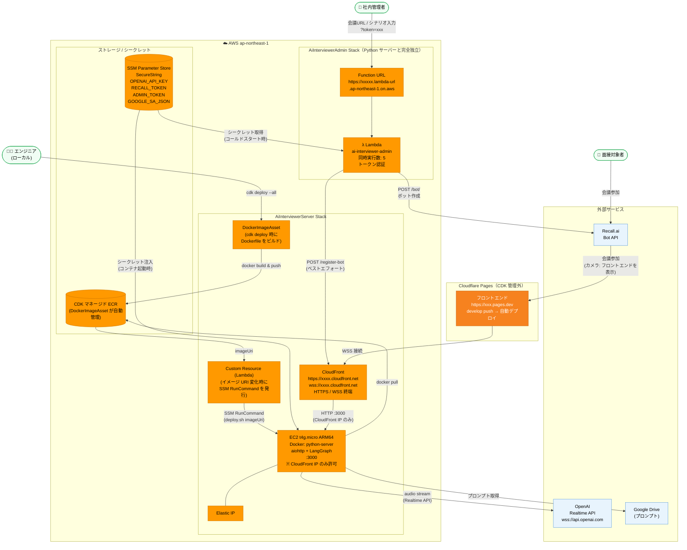
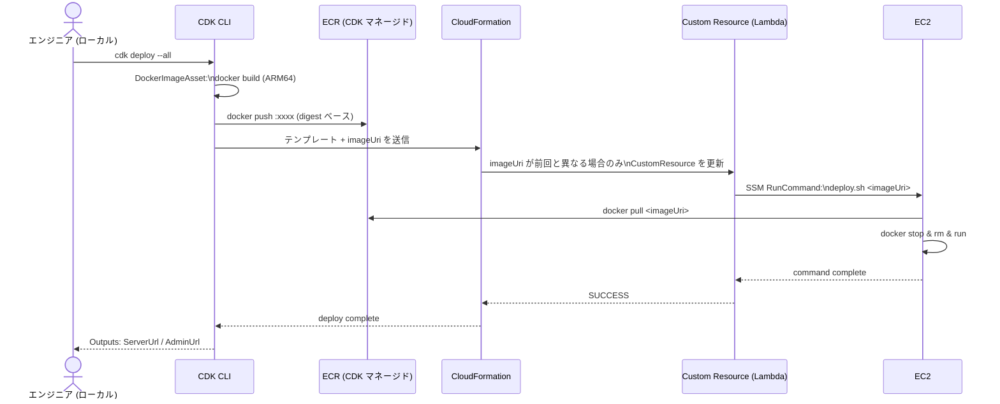
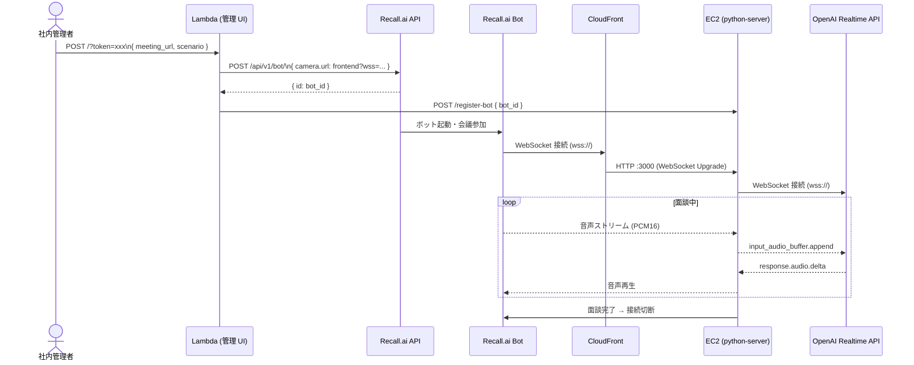
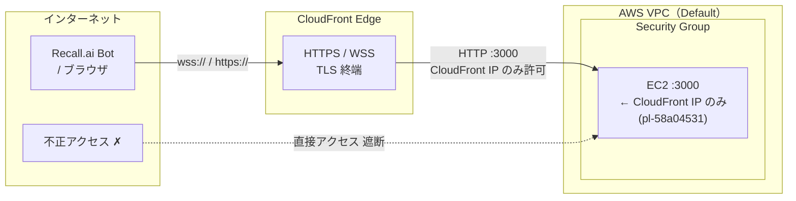

# インフラ構成図

## 全体構成

---

## デプロイフロー (`cdk deploy --all`)

---

## 音声面談フロー

---

## ネットワーク境界

---

## サービス一覧

| サービス | スタック | 役割 | URL |
|---|---|---|---|
| **CloudFront** | AiInterviewerServer | Python サーバーへの HTTPS / WSS エンドポイント | `https://xxxx.cloudfront.net` |
| **EC2 t4g.micro** | AiInterviewerServer | Python (aiohttp + LangGraph) を Docker で実行 | — |
| **Elastic IP** | AiInterviewerServer | EC2 の固定 IP | — |
| **DockerImageAsset** | AiInterviewerServer | cdk deploy 時に Dockerfile をビルドし ECR へプッシュ | — |
| **Custom Resource** | AiInterviewerServer | imageUri 変化時に SSM RunCommand で EC2 を更新 | — |
| **Lambda (管理 UI)** | AiInterviewerAdmin | 管理 UI と Recall.ai ボット参加 API | `https://xxxxx.lambda-url.ap-northeast-1.on.aws` |
| **SSM Parameter Store** | 共通 | API キー・トークン等のシークレット管理 | — |
| **Cloudflare Pages** | CDK 管理外 | フロントエンド (develop push で自動デプロイ) | `https://xxx.pages.dev` |

## デプロイトリガー一覧

| 対象 | トリガー | 方法 |
|---|---|---|
| バックエンド + インフラ | エンジニアが手動実行 | `cdk deploy --all` |
| 管理 UI のみ更新 | エンジニアが手動実行 | `cdk deploy AiInterviewerAdmin` |
| フロントエンド | develop への push (自動) | Cloudflare Pages GitHub 連携 |
